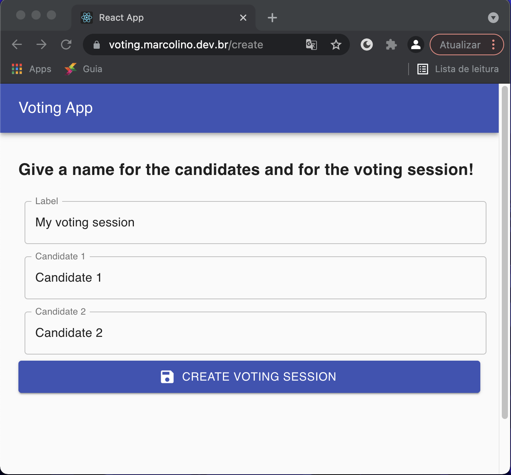
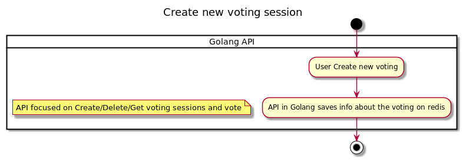
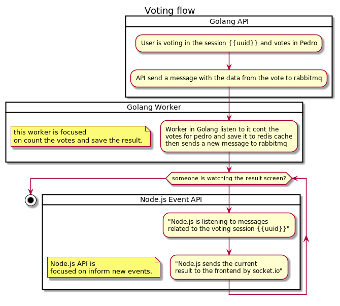
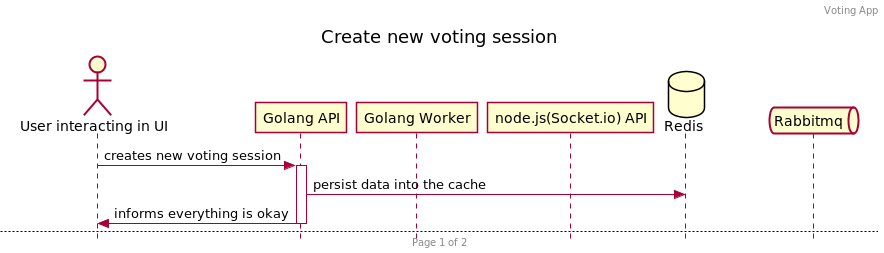
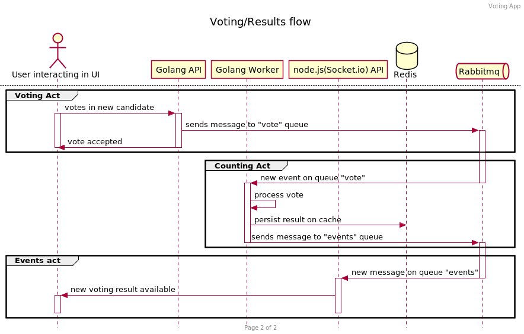

## About The Project
This is a simple voting app, the main and only feature of this app is to show as soon as possible the result of the voting.

This is a very simplify event-driven architecture.

Also, it's possible to see it working on the images below.





### How it works

#### Activity Diagrams
Create new voting session


The Voting and Result workflow:

#### Sequence Diagrams
Create new voting session


The Voting and Result workflow:

### Were used in this project

* Golang
* Node.js
* React
* Rabbitmq
* Redis
* Socket.io
* Docker
* Kubernetes
* Helm
* Github Actions


<!-- GETTING STARTED -->
## Getting Started
run the following commands:
```sh
git clone https://github.com/VictorMarcolino/votingMicroservicesApp.git
docker-compose up -V
```
now access the `localhost:3000`

### Prerequisites

To build this project you only need docker with docker-compose, then simply do `docker-compose up` 


<!-- CONTACT -->
## Contact

Victor Marcolino - marcolino.victor@gmail.com


